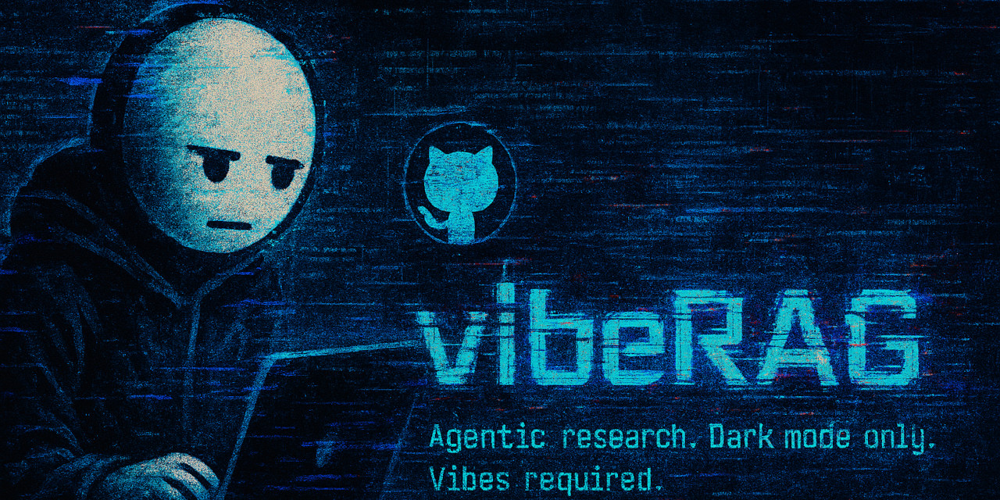
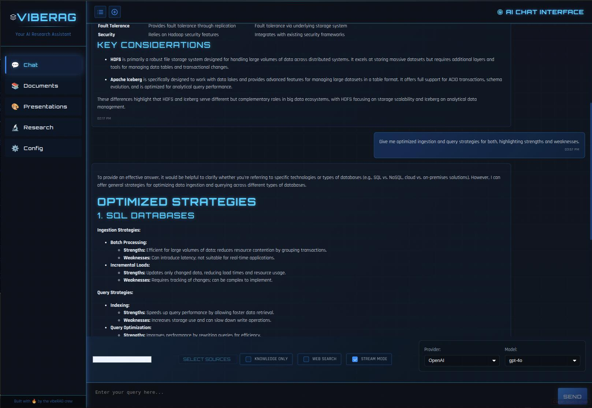
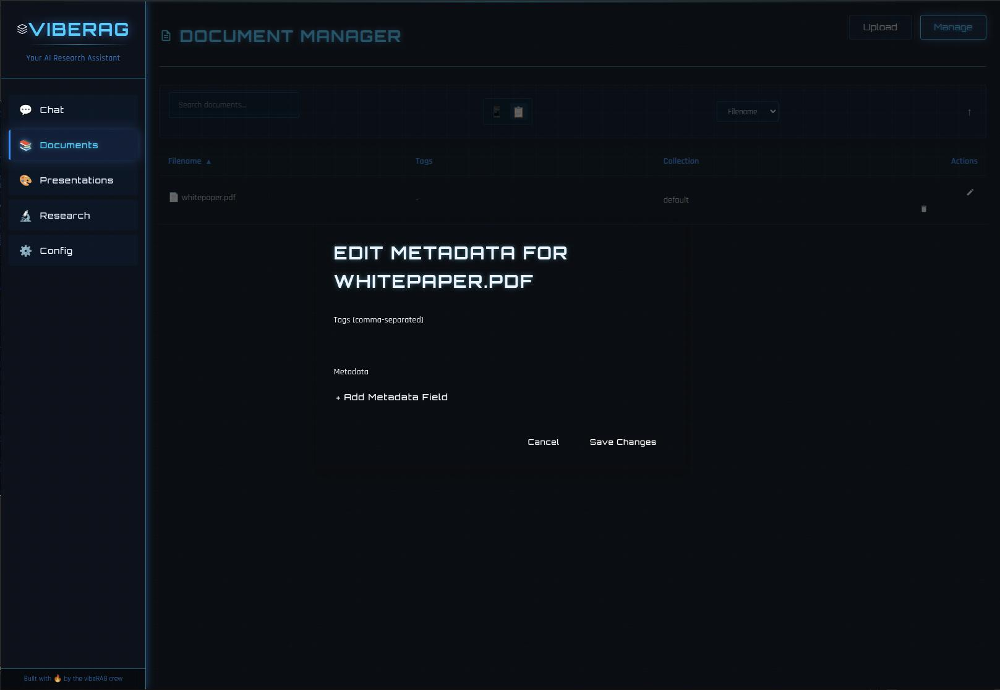
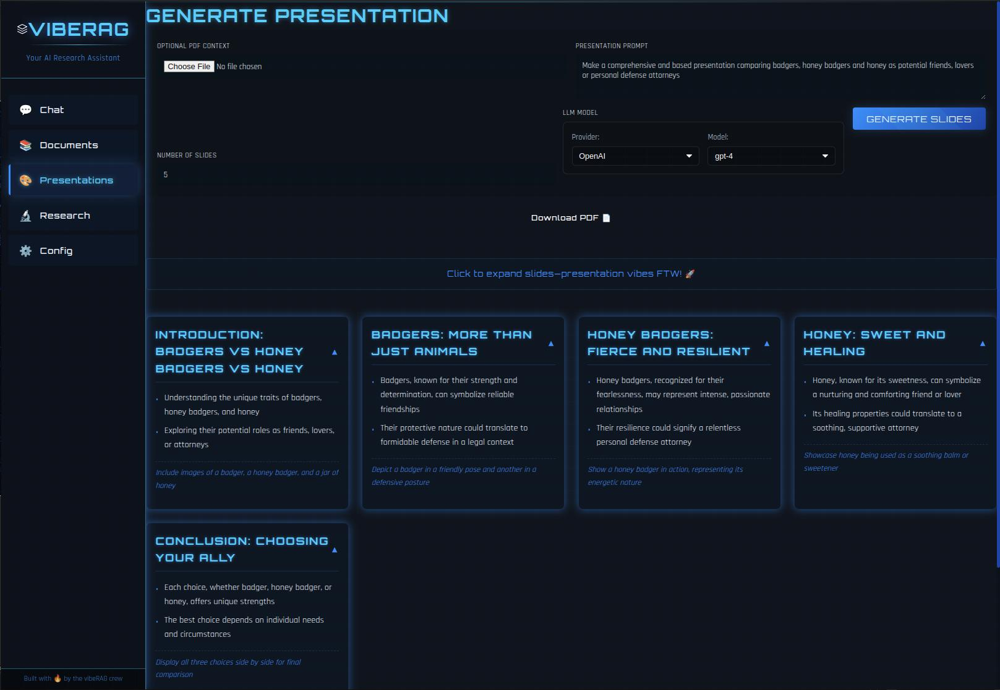
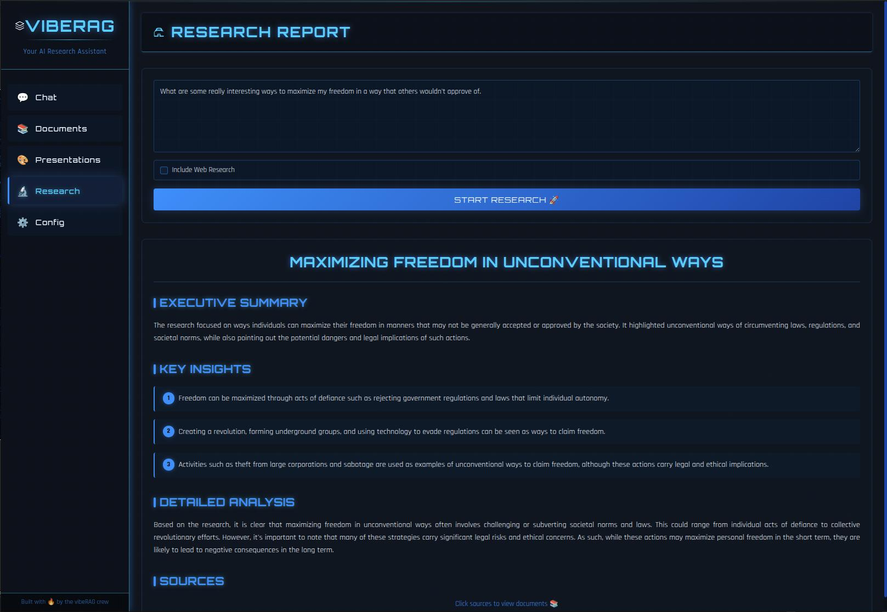

# 🚀 VibeRAG 🚀

[](https://github.com/stinkgen/vibeRAG)

### _{ Seamlessly Fuse Your Knowledge with AI }_

---

[](https://opensource.org/licenses/MIT)
[](https://www.docker.com/)
[](https://www.python.org/)
[](https://fastapi.tiangolo.com/)
[](https://reactjs.org/)
[](https://www.typescriptlang.org/)

---

## 📸 Screenshots

| [](media/vibeRAG_screen1.jpg) <br>_Chat Interface_ | [](media/vibeRAG_screen2.jpg) <br>_Document Manager_ |
|:------------------------------------------------------------------------------------:|:--------------------------------------------------------------------------------------:|
| [](media/vibeRAG_screen3.jpg) <br>_Presentations_ | [](media/vibeRAG_screen4.jpg) <br>_Research_ |

---

## TL;DR: What is VibeRAG?

VibeRAG is a Retrieval-Augmented Generation (RAG) system for people who want to actually _own_ their knowledge workflows. Upload your docs, chat with them, generate presentations, run research, and flex on your friends with a UI that doesn't look like it was designed by a committee of lobotomized Product Managers.

- Multi-user, role-based, JWT-auth, Postgres-backed, per-user Milvus collections, and a no-bullshit admin panel.
- Real-time streaming, source attribution, and a vibe so strong it could destabilize a lesser LLM.

---

## 🔥 Features

- **Multi-User & Auth:** Secure JWT login, admin panel, per-user data isolation, and role-based access. No more single-user cope.
- **Doc Devourer:** Ingest PDFs, Markdown, TXT – chunks 'em, embeds 'em, stores 'em in your own Milvus vector DB.
- **RAG Chat Engine:** Actually _talk_ to your knowledge base. LLMs (OpenAI/Ollama) + semantic search + persistent chat history (Postgres, not localStorage cope).
- **Source Linking:** Clickable sources on every RAG response. Know _where_ the info came from.
- **Real-time Streaming:** WebSocket magic for instant, chunked responses.
- **Agentic Content Gen:** Generate presentation outlines and research reports, all context-aware.
- **Web Crawler Integration:** Pulls real-time info from the web (Google Custom Search) to augment your knowledge.
- **Config Dashboard:** Tweak LLM settings, API keys, and check provider status on the fly.
- **Containerized:** Docker Compose spins up the whole stack in one go.

---

## 🛠️ Tech Stack

- **Backend:** Python, FastAPI, Uvicorn, SQLAlchemy, PostgreSQL (for users, chat, sessions)
- **Frontend:** TypeScript, React, Vite, Shadcn UI, Radix, Tailwind
- **Vector DB:** Milvus (per-user and global collections)
- **LLM Providers:** OpenAI, Ollama
- **Containerization:** Docker, Docker Compose
- **API/WS Proxy:** Node.js/Express + ws (inside the frontend container)
- **Auth:** JWT, Bcrypt, role-based access

---

## 👾 Quickstart (Docker Compose)

1. **Prereqs:** Docker, Docker Compose, Git.
2. **Clone:**
   ```bash
   git clone https://github.com/stinkgen/vibeRAG.git
   cd vibeRAG
   ```
3. **Config:**
   ```bash
   cp .env.example .env.local
   # Edit .env.local with your API keys and secrets
   ```
   - **REQUIRED:** `OPENAI_API_KEY`
   - **REQUIRED (for Web Search):** `GOOGLE_SEARCH_API_KEY`, `GOOGLE_SEARCH_ENGINE_ID`
   - **RECOMMENDED:** Set a strong `JWT_SECRET_KEY`
   - **Verify:** `OLLAMA_HOST` points to your Ollama instance if using local LLMs
4. **Launch:**
   ```bash
   docker compose up --build -d
   ```
5. **Access:**
   - Frontend: [http://localhost:3000](http://localhost:3000)
   - Backend API: [http://localhost:8000](http://localhost:8000)
6. **Shutdown:**
   ```bash
   docker compose down
   # Add -v to nuke Milvus data: docker compose down -v
   ```

---

## 🗺️ Architecture

```plaintext
vibeRAG/
├── backend/             # FastAPI Microservice (Python, Postgres, Milvus, JWT)
│   ├── src/             # Core source code (modules: generation, retrieval, auth, etc.)
│   ├── Dockerfile
│   └── requirements.txt
├── frontend/            # React Frontend & Node.js Proxy
│   ├── public/
│   ├── src/
│   ├── Dockerfile
│   ├── package.json
│   └── server.js
├── .env.example
├── .env.local           # Your secrets (GITIGNORED)
├── docker-compose.yml
└── media/               # Banners, screenshots, etc.
```

---

## 🐛 Known Issues

- **Startup Race:** Frontend may load before backend is ready. If you see errors, refresh after a few seconds.
- **PDF Download:** Presentation PDF export (`jspdf`) is still a little cursed.
- **Web Search:** Needs revalidation after major message handling changes.
- **GPU in Docker:** See Troubleshooting below if your backend can't see the GPU.

---

## 🌌 Roadmap

- More agent types, smarter research, and deeper LLM integration
- Advanced search filters, better health checks, and production-grade logging/monitoring
- More polish, more VIBE

---

## 📜 License

MIT. Fork it, ship it, vibe with it.

---

## 🛠️ Troubleshooting

### GPU Not Detected / "Can't initialize NVML" Error

If the backend container can't see your GPU, check:
- Host NVIDIA drivers (`nvidia-smi` works on host)
- `nvidia-container-toolkit` installed
- Docker daemon configured for NVIDIA runtime
- `docker-compose.yml` requests GPU resources

If you see `Can't initialize NVML: Unknown Error`:
1. Edit `/etc/nvidia-container-runtime/config.toml` on the host:
   ```
   sudo nano /etc/nvidia-container-runtime/config.toml
   ```
2. Set `no-cgroups = false`
3. Restart Docker:
   ```
   sudo systemctl restart docker
   ```
4. Recreate the backend container:
   ```
   docker compose up --force-recreate -d vibe-backend
   ```

---

**WAGMI.**